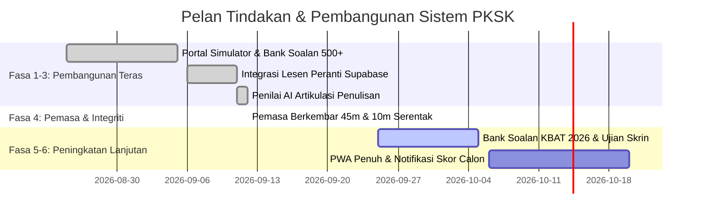

# 🗺️ ROADMAP: Sistem Simulator PKSK Online & Penilai AI Artikulasi Penulisan

> **Status Semasa:** FASA 5 SEDANG DILAKSANAKAN (Variasi Esei & Penalaan Rubrik Melayu Baku Selesai)  
> **Sasaran Utama:** PKSK Sesi Kemasukan 2026 / 2027

---

## 🎯 Garis Masa & Status Milestone

---

### ✅ Milestone Selesai

- [x] **Fasa 1: Portal Simulator PKSK & Bank Soalan 500+**
  - Arkitektur UI responsif mengikut tema portal KPM.
  - Pecahan Bahagian A (30 soalan), Bahagian B (70 soalan), Bahagian C (Esei).
  - Skim pemarkahan objektif automatik beserta slip keputusan rasmi.

- [x] **Fasa 2: Pengurusan Lesen Supabase Cloud**
  - Integrasi jadual `pksk_licenses` di Supabase (`rvslrscgbhgdcktdtfrl`).
  - Sistem pengaktifan kunci lesen peranti dengan status perkakasan.

- [x] **Fasa 3: Penilai AI Artikulasi Penulisan (Ox Alpha + Gemini)**
  - Rubrik pemarkahan berasaskan 4 kriteria LPM.
  - Penjanaan tajuk rawak automatik setiap kali sesi dimuatkan.
  - Cadangan idea esei dipadatkan kepada 4–6 frasa ringkas.

- [x] **Fasa 4: Penyelarasan Pemasa Berkembar & Anti-Salin**
  - Pemasa 45 minit menjawab esei diselaraskan serentak dengan pemasa 10 minit penutupan cadangan idea.
  - Modul anti-salin (`user-select: none` & sekatan copy event) aktif pada kotak cadangan isi.
  - Penerbitan terkini di Vercel: [https://pksk2026.vercel.app](https://pksk2026.vercel.app).

---

### 🔄 Fasa 5: Bank Soalan Tambahan & Peningkatan Model Analisis AI (Fasa Aktif)

- [ ] Penambahan soalan format KBAT terkini untuk subjek Sains & Matematik.
- [x] Penalaan lanjut prompt penilaian tatabahasa Melayu Baku pada enjin AI (Tatabahasa Dewan DBP & kesilapan morfologi/sintaksis spesifik).
- [x] Penambahan 22 variasi tajuk esei Bahagian C merangkumi Buli di Sekolah, Ko-Akademik, Kokurikulum, Teknologi AI/Media Sosial, Sambutan Hari Kebangsaan & Hari Malaysia (sesuai calon 12-13 tahun).
- [x] PWA Penuh & Ikon Rasmi Korporat Janaan ChatGPT (DALL-E) dengan latar belakang PNG telus, perkataan PKSK, dan simbol AI di bucu atas kanan (manifest.json, sw.js, ikon 192/512/64px).
- [ ] Penambahbaikan susun atur kad cadangan esei bagi peranti skrin kecil (< 380px).
- [ ] Integrasi pemantauan status pangkalan data Supabase melalui pelayan Supabaseauto.
