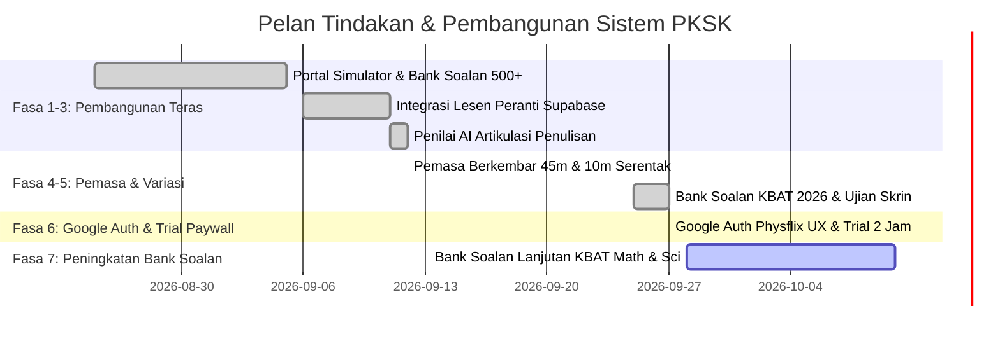

# 🗺️ ROADMAP: Sistem Simulator PKSK Online & Penilai AI Artikulasi Penulisan

> **Status Semasa:** FASA 6 SELESAI (Google OAuth Physflix UX, Percubaan 2 Jam & Paywall Kunci Lesen Siap Sepenuhnya)  
> **Sasaran Utama:** PKSK Sesi Kemasukan 2026 / 2027

---

## 🎯 Garis Masa & Status Milestone

---

### ✅ Milestone Selesai

- [x] **Fasa 1: Portal Simulator PKSK & Bank Soalan 500+**
  - Arkitektur UI responsif mengikut tema portal KPM.
  - Pecahan Bahagian A (30 soalan), Bahagian B (70 soalan), Bahagian C (Esei).
  - Skim pemarkahan objektif automatik beserta slip keputusan rasmi.

- [x] **Fasa 2: Pengurusan Lesen Supabase Cloud**
  - Integrasi jadual `pksk_licenses` di Supabase (`rvslrscgbhgdcktdtfrl`).
  - Sistem pengaktifan kunci lesen peranti dengan status perkakasan.

- [x] **Fasa 3: Penilai AI Artikulasi Penulisan (Ox Alpha + Gemini)**
  - Rubrik pemarkahan berasaskan 4 kriteria LPM.
  - Penjanaan tajuk rawak automatik setiap kali sesi dimuatkan.
  - Cadangan idea esei dipadatkan kepada 4–6 frasa ringkas.

- [x] **Fasa 4: Penyelarasan Pemasa Berkembar & Anti-Salin**
  - Pemasa 45 minit menjawab esei diselaraskan serentak dengan pemasa 10 minit penutupan cadangan idea.
  - Modul anti-salin (`user-select: none` & sekatan copy event) aktif pada kotak cadangan isi.
  - Penerbitan terkini di Vercel: [https://pksk2026.vercel.app](https://pksk2026.vercel.app).

- [x] **Fasa 5: Bank Soalan Tambahan & Peningkatan Model Analisis AI**
  - Penalaan lanjut prompt penilaian tatabahasa Melayu Baku pada enjin AI.
  - Penambahan 22 variasi tajuk esei Bahagian C.
  - PWA Penuh & Ikon Rasmi Korporat Janaan ChatGPT.
  - Sistem Pintasan & Kunci Induk Pembangun ('PKSK-DEV-MASTER-2026' & '?dev=unlock').
  - Kad Kawalan Pilihan Tema & Dropdown Tajuk Esei Bahagian C.
  - Pengoptimuman UI & UX Responsif Penuh untuk Semua Telefon Pintar & Tablet.

- [x] **Fasa 6: Google OAuth Physflix UX & Percubaan Percuma 2 Jam**
  - Integrasi penuh Google OAuth Supabase dengan Hero sinematik ala Physflix.
  - Pengalihan automatik (*auto-redirect*) terus ke Dashboard sejurus log masuk.
  - Menu Dropdown Profil Avatar interaktif berserta butang Log Keluar.
  - Penguatkuasaan Tempoh Percubaan 2 Jam (`TRIAL_DURATION_MS = 2 Jam`) dan auto-lock sistem.
  - Notis tamat tempoh, medan Kunci Lesen 16-digit, dan butang pembelian terus Telegram `@halimroslan`.
  - Penyesuaian margin simetri banner 1080px sejajar dengan kad ujian.
  - Pembersihan UI: Penyingkiran tab lewah, butang bertindih, dan modal lesen yang fokus.

---

### 🔄 Fasa 7: Peningkatan Bank Soalan Lanjutan KBAT Math & Sains (Fasa Seterusnya)

- [ ] Penambahan soalan format KBAT terkini untuk subjek Sains & Matematik.
- [ ] Ujian keserasian paparan penuh untuk peranti telefon pintar skrin ultra kecil (< 360px).
- [ ] Integrasi pemantauan status pangkalan data Supabase melalui pelayan Supabaseauto.
